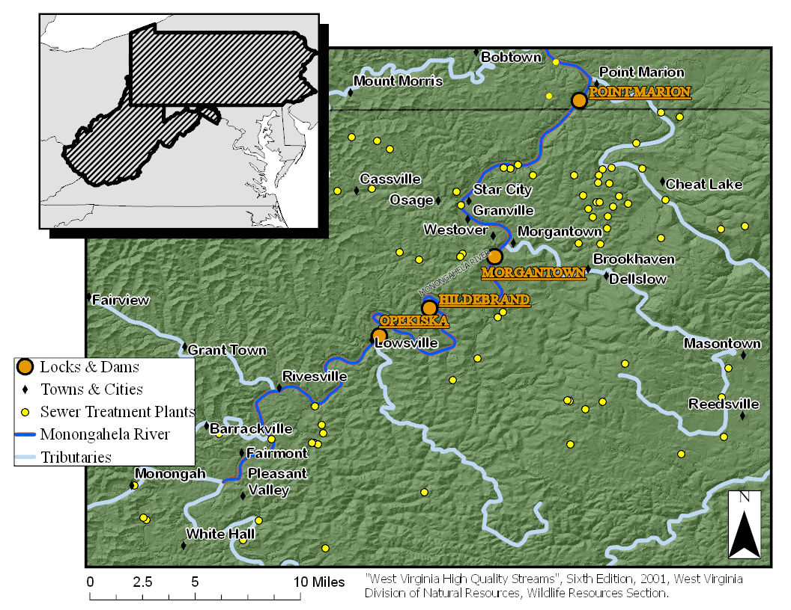

\newpage


6 Apr 2021

Kaylyn Zipp

West Virginia University

62 Morrill Way

Morgantown, WV 26505

(607) 267 5007

kz00001@mix.wvu.edu

RH: Kaylyn Zipp * Microplastics Freshwater

**Discovering Preliminary Spatial and Demographic Relationships in Suuspected Microplastic Consumption in Smallmouth Bass in the Monongahela River**

Kaylyn Zipp1 *West Virginia University, 62 Morrill Way, Morgantown, WV 26505 USA* 


|          Microplastic research has exploded since the early 2000's in part because of a growing social concern fueled by social media campaigns (Petersen & Hubbart, 2020). References of microplastics jumped from just 2 in 2009 to 939 in 2019 (Peterson & Hubbart, 2020). Microplastics are any plastic particles under 5mm in length (Estahbanati & Fahrenfeld, 2016). There is no limit to the size of microplastics and new size categories are currently under debate to incorporate the wide range of sizes they encompass (Barboza et al., 2018; Li et al., 2018). Freshwater research of microplastics is just beginning to gain momentum, previously only making up 4% of the total research body on microplastics (Li et al., 2018). Currently of the 39 articles published about freshwater biota and microplastics, 25 are lab experiments assessing impacts on fish (Yao et al., 2020). Although lab experiments are necessary for comprehending the threat microplastics pose, an understanding of the reality of microplastics within our freshwater systems is clearly needed. Recently microplastics in freshwater systems were labeled an emerging threat due to their detrimental physical impact and potential to act as a vector for other contaminants (Grigorakis & Drouillard, 2018). 

|          The microplastics themselves have the potential to irritate the stomach and intestines, damage tissue, and cause feelings of false satiation impacting the individuals' energy intake (Bellasi et al.,2020). They can also accumulate and create blockages. Microplastics have also been shown to accumulate and transport polychlorinated biphenyls (PCBs), persistent organic pollutants (POPs), polybrominated diphenyl ethers (PBDEs), metals, bacteria and other pathogens into aquatic life (Bellasi et al.,2020). Microplastics vector capacity and impact is debated and is dependent on the characteristics of the plastic in question and the environment. Characteristics influencing the vector capacity include size, polymer composition, shape, and age. These characteristics are also intrinsically tied to their hydrodynamics (Bellasi et al.,2020).  


|          Using the term microplastics does not convey the complexity of existence under that umbrella. The complexity in microplastics characteristics changes their movement through the watershed affecting their bioavailability. Microplastics in riverine habitats in particular have been greatly ignored. 80% of microplastic pollution in the ocean comes from terrestrial sources mainly through rivers (Wagner et al., 2014). Previously designated as highways for microplastic pollution in the ocean, the potential for storage of microplastics within the system was greatly ignored. Currently fisheries biologists and management agencies lack an understanding of abundance and exposure to microplastics and their potential to accumulate within an organism. This study aims to determine if there are preliminary spatial patterns that occur with microplastic consumption based on microplastics size in Smallmouth Bass, *Micropterus dolomieu*, in the upper Monongahela River, WV. It also aims to explore preliminary demographic data to understand if portions of the population are more susceptible to plastic accumulation based on their life history. By identifying vulnerable portions of the population as well as locations of increased bioavailability through consumption this study should aid management in prioritizing further research and mitigation efforts.    


|          The study aims to answer four questions. Firstly, it will determine if there differences between sites on the upper Monongahela River in total count of suspected microplastics in smallmouth bass, **Micropterus dolomieu**. It is generally accepted that total microplastics increases as one moves from higher order streams to lower order streams and that it will increase past a dense urban center (Kowalski et al., 2016). It is predicted that the results will support this finding. 


|          Secondly this study will determine if there are differences between sites in the count of suspected microplastics when examined by size in Smallmouth Bass. It is suspected that differences may arise when smallmouth bass consumption of suspected microplastics are examined on a size basis. Size impacts the gravitational settling of microplastics and its hydro-cycling in the riverscape. Additionally, locks and dams have been shown to alter accumulation and settling rates (McNeish et al., 2018). The Monongahela River has a number of locks and dams that could alter the cycling of plastic within the environment, creating "stop lights" on the highway, retaining certain size classes within the locks making them more bioavailable for ingestion. Generally, all size classes will not be equally represented in the various locations. We expect that larger plastics will be more ubiquitous with little difference between sites, while smaller plastics will have site distinct accumulation and more variability due to differences in point and nonpoint source pollution.


|          Finally, this study will examine the population demographics of pooled data and determine if there are significant relationships between the accumulation of total microplastics based on sex, length, and weight. It is hypothesized that total suspected plastics will be higher in females than males and in shorter individuals than longer ones. Smallmouth bass are zoobenthivores, meaning that benthic macroinvertebrates like crayfish make up a significant portion of their diet throughout their life. Benthic macroinvertebrates have been shown to accumulate microplastics (Zhang ET AL., 2021; Windsor et al., 2019). Additionally, accumulation of microplastics in the round goby, *Neogobius melanostomus*, has been attributed to its zoobenthivory (McNeish et al., 2018). Since this sampling was conducted in May, prior to spawning, It is believed that females will have higher accumulations of microplastics because they are potentially consuming more prey in preparation for the high energetic cost of spawning. Length will be used as a proxy for ontogenetic shift and gape width. Shorter individuals are assumed to have smaller gapes that longer individuals would be more heavily reliant on macroinvertebrates. Shorter individuals will accumulate more total suspected microplastic than longer individuals because their diet composition will have a higher percentage of macroinvertebrates. 

**STUDY AREA**

|          Samples were collected from Opepiska Pool, Morgantown Pool and the Point Marion Pool on the Monongahela River using boat electroshocking in May 2020 (Figure 1).

**METHODS**

|          Samples were taken back to West Virginia University where length, weight, and sex were recorded. Otoliths were removed and cracked and burned to determine age. Viscera were then removed, marked, and stored in whirlbags in a freezer at -4°C until analysis. Samples were defrosted in a warm water bath and processed for future diet analyses prior to digestion in a (w/v) 10% KOH solution in a petri dish in an oven at 40°C for 24 hours. Post digestion, samples were diluted and run through a sieve tower containing 500μm, 300μm, 212μm, 106μm, and 20μm sieves to separate particles based on size. Each sieve was then washed into a Buchner funnel and collected onto a 47mm 11 μm filter paper and dried prior to visual inspection. Strict contamination protocol were followed including washing down surfaces with ethanol as well as UltraPure water and wearing nitrile gloves. A series of blanks were run as controls including a parallel air blank, transfer blank and blanks of UltraPure water. Microplastic counts will be referred to as suspected microplastic counts since chemical confirmation is currently not complete.  


|          All analyses for site location differences were run using Poisson general linearized models using the glm function in the package MASS in RStudio since total count of suspected microplastics as well as each size class was not normal according to the Shapiro-Wilkes test (alpha<.05) and the data was composed of counts. Total counts of suspected microplastic were modeled as a Poisson random variable (yi ∼ Poisson(λi)). Null hypothesis testing was preformed to evaluate differences based on location with total plastics as the response variable and location as the predictor with an alpha value of .05. Since modeling output only reports differences between the reference site and the other two sites, contrasts were also preformed to determine if significant differences existed between the non-reference sites using null hypothesis testing and an alpha value of .05. All contrasts were performed using the function glht in the package multcomp in R. Data was then further analyzed based on size with each sieve size modeled as a Poisson random variable. Individual Poisson models were fit with the count of suspected microplastics in each sieve size as the response and location as a predictor. For example, a Poisson model was fit to describe the count of suspected microplastics for the 500μm sieve predicted by location. Null hypothesis significance testing was conducted for each sieve size model with an alpha level of .05. Contrasts were preformed again to determine if significant differences existed using null hypothesis testing between the non-reference sites using an alpha value of .05.


|          Prior to analyzing suspected microplastic consumption based on demographics, the demographics of the smallmouth bass from each lock were analyzed per pool. It was assumed that if no site-specific differences occurred for sex, weight or length then samples could be pooled without concern. Each variable; sex, weight, or length, was then modeled as a response based on the predictor, location. Sex was modeled as a Binomial random variable: yi∼Binomial(n,p) using the glm function in the package MASS in RStudio. Null hypothesis testing was performed with an alpha value of .05. Weight and length were modeled as Gamma random variables: yi~Gamma(α, β) and modeled using the glm function in the package MASS in RStudio. Null hypothesis testing was performed with an alpha value of .05. Contrasts were also performed to determine if significant differences existed between the non-reference sites using null hypothesis testing. No significant differences were found when demographic variables (sex, weight, or length), were explained by pool location and so all samples were pooled for the demographic analysis. 


|          All demographic analyses were also run using Poisson general linearized models using the glm function in the package MASS in RStudio. Sex, weight and length were each modeled as a predictor of total suspected microplastics with total count of suspected microplastic modeled as a Poisson random variable response (yi ∼ Poisson(λi)). Individuals whose sex was not identified were removed. An additional Poisson model was run with total suspected microplastics as the response and an interaction between weight and length as the predictor. Null hypothesis significance testing was conducted on each model with an alpha level of .05.


**RESULTS** 

**Spatial Characterization of Suspected Microplastics in the Digestive Tract**

|          For this study 42 samples total were processed 11 from Opekiska Pool, 17 from the Morgantown Pool and 14 from the Point Marion Pool. Significant differences were found in the count of total suspected microplastics between Opekiska pool and the Morgantown pool but not the Morgantown Pool and the Point Marion Pool (Figure 2). This agrees with previous literature which suggest that as we follow a stream down river plastics concentrations will generally change, especially past urban centers. What is interesting to note is the lack of difference between the Morgantown Pool and the Point Marion Pool.

|          Mean expected count of suspected microplastics greater than 500μm was significantly different between the Opeiska Pool and the Morgantown Pool but not the Point Marion Pool and the Morgantown Pool (Figure 3). Mean expected count of suspected microplastics greater than 500μm was also not significantly different between the Point Marion Pool and the Opekiska Pool. Confidence intervals overlap for all three sites suggesting that with more sampling there may be no significant differences in this size range and this size range is more ubiquitous throughout the environment. Individuals from the Morgantown Pool are expected to have roughly 1 more piece of plastic within their digestive tract than individuals from the Opekiska Pool.

|          Mean expected count of suspected microplastics greater than 300μm but less than 500 was not significantly different between the Opeiska Pool and the Morgantown Pool but significantly different between the Point Marion Pool and the Morgantown Pool (Figure 4). Expected count increased by 2 between the Morgantown Pool and the Point Marion Pool, meaning individuals from the Point Marion Pool had 2 more expected suspected microplastics in this size range than individuals from the Morgantown Pool. Mean expected count of suspected microplastics greater than 300μm but less than 500μm was significantly different between the Point Marion Pool and the Opekiska Pool. Expected count within the digestive tract increased by 1 between the locations with Point Marion smallmouth bass having one more than individuals from Opekiska. 

|          Mean expected count of suspected microplastics greater than 212μm but less than 300μm was not significantly different between the Opeiska Pool and the Morgantown Pool or the Opekiska and the Point Marion Pool. It was significantly different between the Point Marion Pool and the Morgantown Pool (Figure 5). Expected count increased by 1 between the Morgantown Pool and the Point Marion Pool, with Point Marion smallmouth bass having an additional piece of suspected microplastic compared to Morgantown Pool smallmouth bass. 

|          Mean expected count of suspected microplastics greater than 106μm but less than 212μm was not significantly different between the Opeiska Pool and the Morgantown Pool or the Point Marion and the Morgantown Pool. It was significantly different between the Point Marion Pool and the Opekiska Pool (Figure 6). Expected count increased by 1 between smallmouth bass in the Point Marion Pool and the Opekiska Pool. 

|          Mean expected count of suspected microplastics greater than 20μm but less than 106μm was significantly different between the Opeiska Pool and the Morgantown Pool but not the Point Marion and Morgantown Pool. Expected count increased by 1 with bass from the Opekiska Pool having one less suspected microplastic particle in this range than individuals from the Morgantown Pool. It was also significantly different between the Point Marion Pool and the Opekiska Pool (Figure 7). Expected count increased by 2 between with smallmouth bass from the Point Marion Pool having approximately 2 more suspected microplastic particles in this size range than their Opekiska counterparts. 

**Demographic Characterization of Suspected Microplastics in the Digestive Tract**

|          When all 42 samples were pooled 20 were males, 21 were females and 1 was unidentifiable and removed. When differences between the sexes were examined, significant differences were found between total suspected microplastics (Figure 8). Expected count was not explored since it is not believed to be biologically relevant since it encompasses a wide range of plastic sizes.  

|          All 42 samples were used for determining if there was a relationship between weight and total suspected plastics. There was a significant relationship between weight and total plastics (Figure 9). Confidence intervals are tighter for individuals who weigh less than those that weigh more due to higher representation of smaller fish. This is accurate for the system in question which tends not to have larger heavier older individuals. There was no significant differences between the length of an individual and the total suspected microplastics they consumed when examined (p-value = 0.289). When an interaction was included between length and weight all three parameters were significant (Figure 10).

\newpage
**REFERENCES** 

Barboza, L. G. A., Vieira, L. R., Branco, V., Figueiredo, N., Carvalho, F., Carvalho, C., & Guilhermino, L. 2018. Microplastics cause neurotoxicity, oxidative damage and energy-related changes and interact with the bioaccumulation of mercury in the European seabass, Dicentrarchus labrax. Aquatic toxicology. 195:49-57.

Bellasi, A., Gilberto, B., Pozzi, A., Galafassi, S., Volta, P. & Bettinetti, R., 2020. Microplastic Contamination in Freshwater Environments: A Review, Focusing on Interactions with Sediments and Benthic Organisms. Environments. 7:30.

Estahbanati, S., &  N. L. Fahrenfeld. 2016. Influence of wastewater treatment plant discharges on microplastic concentrations in surface water. Chemosphere, 162:277-284.

Grigorakis, S., &  K. G. Drouillard. 2018. Effect of microplastic amendment to food on diet assimilation efficiencies of PCBs by fish. Environmental Science & Technology, 52(18):10796-10802.

Kowalski. N., Reichardt, A. M., and J. J. Waniek. 2016. "Sinking rates of microplastics and potential implications of their alteration by physical, biological, and chemical factors." Marine pollution bulletin 109.1:310-319.

McNeish, R. E., Kim, L. H., Barrett, H. A., Mason, S. A., Kelly, J. J., & T. J. Hoellein. 2018. Microplastic in riverine fish is connected to species traits. Scientific reports. 8:1-12.

Li, J., Liu, H., &  J. P. Chen. 2018. Microplastics in freshwater systems: A review on occurrence, environmental effects, and methods for microplastics detection. Water Research. 137:362-374.

Petersen, F., & J. A. Hubbart. 2020. The Occurrence and Transport of Microplastics: The State of the Science. Science of The Total Environment. 143936.

Wagner, M., Scherer, C., Alvarez-Muñoz, D., Brennholt, N., Bourrain, X., Buchinger, S., ... & G. Reifferscheid. 2014. Microplastics in freshwater ecosystems: what we know and what we need to know. Environmental Sciences Europe, 26:1-9.

Windsor, F. M., Tilley, R. M., Tyler, C. R., & S. J.Ormerod. 2019. Microplastic ingestion by riverine macroinvertebrates. Science of the total environment. 646:68-74.

Yao, L., Hui, L., Yang, Z., Chen, X., & A.Xiao. 2020. Freshwater microplastics pollution: Detecting and visualizing emerging trends based on Citespace II. Chemosphere. 245:125627.

Zhang, D., Fraser, M. A., Huang, W., Ge, C., Wang, Y., Zhang, C., & P. Guo. 2021. Microplastic pollution in water, sediment, and specific tissues of crayfish (*Procambarus clarkii*) within two different breeding modes in Jianli, Hubei province, China. Environmental Pollution, 272:115939.


\newpage
**FIGURES** 
```{r, echo=FALSE}

#library("rstudioapi")
#setwd(dirname(rstudioapi::getActiveDocumentContext()$path))
#getwd()



```

Figure 1.

\newpage
```{r pressure, echo=FALSE}
#setwd("~/Desktop/Microplastics/Thesis-main") *Don't need now
data<-read.csv("smb_gen_data.csv")
library(multcomp)
fit.totalplast.pool<-glm(total_plast ~ pool, family = poisson, data =data)
x <- matrix(c(0, -1, 1), nrow = 1)
cntr <- glht(model = fit.totalplast.pool, linfct = x)

pool<-factor(c('op', 'mn', 'pm'))

nd <- data.frame(
  pool = pool
)
prd <- predict.glm(object = fit.totalplast.pool, newdata = nd, type = 'link',
                   
                   se.fit = T)

low <- exp(prd$fit - qnorm(0.975) * prd$se.fit)
high <- exp(prd$fit + qnorm(0.975) * prd$se.fit)

plot(y = exp(prd$fit), x = nd$pool, xlab = 'Pool',
     ylab = 'Expected count of total suspected microplastics', cex.axis = 1, cex.lab = 1,
     ylim = c(min(low), max(high)), type = 'l')

points(x = nd$pool, y = low, lty = 2)
points(x = nd$pool, y = high, lty = 2)


```

Figure 2.

\newpage
```{r, echo=FALSE}
#setwd("~/Desktop/Microplastics/Thesis-main") *Don't need now
data<-read.csv("smb_gen_data.csv")
library(multcomp)
fit.500.pool<-glm(X500 ~ pool, family = poisson, data =data)
x <- matrix(c(0, -1, 1), nrow = 1)
cntr <- glht(model = fit.500.pool, linfct = x)

pool<-factor(c('op', 'mn', 'pm'))

nd <- data.frame(
  pool = pool
)
prd <- predict.glm(object = fit.500.pool, newdata = nd, type = 'link',
                   
                   se.fit = T)

low <- exp(prd$fit - qnorm(0.975) * prd$se.fit)
high <- exp(prd$fit + qnorm(0.975) * prd$se.fit)

plot(y = exp(prd$fit), x = nd$pool, xlab = 'Pool',
     ylab = 'Expected count of suspected microplastics greater than 500μm', cex.axis = 1, cex.lab = 1,
     ylim = c(min(low), max(high)), type = 'l')

points(x = nd$pool, y = low, lty = 2)
points(x = nd$pool, y = high, lty = 2)
```

Figure 3. 

\newpage
```{r, echo=FALSE}
#setwd("~/Desktop/Microplastics/Thesis-main")  *Don't need now
data<-read.csv("smb_gen_data.csv")
library(multcomp)

fit.300.pool<-glm(X300 ~ pool, family = poisson, data =data)
x <- matrix(c(0, -1, 1), nrow = 1)
cntr <- glht(model = fit.300.pool, linfct = x)

nd <- data.frame(
  pool = pool
)
prd <- predict.glm(object = fit.300.pool, newdata = nd, type = 'link',
                   
                   se.fit = T)

low <- exp(prd$fit - qnorm(0.975) * prd$se.fit)
high <- exp(prd$fit + qnorm(0.975) * prd$se.fit)

plot(y = exp(prd$fit), x = nd$pool, xlab = 'Pool',
     ylab = 'Expected count of suspected microplastics greater than 300μm but less than 500μm', cex.axis = 1, cex.lab = .6,
     ylim = c(min(low), max(high)), type = 'l')

points(x = nd$pool, y = low, lty = 2)
points(x = nd$pool, y = high, lty = 2)
```

Figure 4. 

\newpage
```{r, echo=FALSE}
#setwd("~/Desktop/Microplastics/Thesis-main")  *Don't need now
data<-read.csv("smb_gen_data.csv")
library(multcomp)
fit.212.pool<-glm(X212 ~ pool, family = poisson, data =data)
x <- matrix(c(0, -1, 1), nrow = 1)
cntr <- glht(model = fit.212.pool, linfct = x)

nd <- data.frame(
  pool = pool
)
prd <- predict.glm(object = fit.212.pool, newdata = nd, type = 'link',
                   
                   se.fit = T)

low <- exp(prd$fit - qnorm(0.975) * prd$se.fit)
high <- exp(prd$fit + qnorm(0.975) * prd$se.fit)

plot(y = exp(prd$fit), x = nd$pool, xlab = 'Pool',
     ylab = 'Expected count of suspected microplastics greater than 212μm but less than 300μm', cex.axis = 1, cex.lab = .6,
     ylim = c(min(low), max(high)), type = 'l')

points(x = nd$pool, y = low, lty = 2)
points(x = nd$pool, y = high, lty = 2)
```

Figure 5. 

\newpage
```{r, echo=FALSE}
#setwd("~/Desktop/Microplastics/Thesis-main") *Don't need now
data<-read.csv("smb_gen_data.csv")
library(multcomp)

fit.106.pool<-glm(X106 ~ pool, family = poisson, data =data)

x <- matrix(c(0, -1, 1), nrow = 1)
cntr <- glht(model = fit.106.pool, linfct = x)


nd <- data.frame(
  pool = pool
)
prd <- predict.glm(object = fit.106.pool, newdata = nd, type = 'link',
                   
                   se.fit = T)

low <- exp(prd$fit - qnorm(0.975) * prd$se.fit)
high <- exp(prd$fit + qnorm(0.975) * prd$se.fit)

plot(y = exp(prd$fit), x = nd$pool, xlab = 'Pool',
     ylab = 'Expected count of suspected microplastics greater than 106μm but less than 212μm', cex.axis = 1, cex.lab = .6,
     ylim = c(min(low), max(high)), type = 'l')

points(x = nd$pool, y = low, lty = 2)
points(x = nd$pool, y = high, lty = 2)
```

Figure 6. 

\newpage
```{r, echo=FALSE}
#setwd("~/Desktop/Microplastics/Thesis-main")  *Don't need now
data<-read.csv("smb_gen_data.csv")
library(multcomp)
fit.20.pool<-glm(X20 ~ pool, family = poisson, data =data)

x <- matrix(c(0, -1, 1), nrow = 1)
cntr <- glht(model = fit.20.pool, linfct = x)

nd <- data.frame(
  pool = pool
)
prd <- predict.glm(object = fit.20.pool, newdata = nd, type = 'link',
                   
                   se.fit = T)

low <- exp(prd$fit - qnorm(0.975) * prd$se.fit)
high <- exp(prd$fit + qnorm(0.975) * prd$se.fit)

plot(y = exp(prd$fit), x = nd$pool, xlab = 'Pool',
     ylab = 'Expected count of suspected microplastics greater than 106μm but less than 212μm', cex.axis = 1, cex.lab = .6,
     ylim = c(min(low), max(high)), type = 'l')

points(x = nd$pool, y = low, lty = 2)
points(x = nd$pool, y = high, lty = 2)
```

Figure 7. 

\newpage
```{r, echo=FALSE}
#setwd("~/Desktop/Microplastics/Thesis-main")  *Don't need now
data<-read.csv("smb_gen_data.csv")
library(multcomp)
data.na.omit<-data[-c(12), ]
fit.totalplast.sex<-glm(total_plast ~ sex, family = poisson, data =data.na.omit)

sex<-factor(c('f', 'm'))

nd <- data.frame(
  sex = sex
)
prd <- predict.glm(object = fit.totalplast.sex, newdata = nd, type = 'link',
                   
                   se.fit = T)

low <- exp(prd$fit - qnorm(0.975) * prd$se.fit)
high <- exp(prd$fit + qnorm(0.975) * prd$se.fit)

plot(y = exp(prd$fit), x = nd$sex, xlab = 'Sex',
     ylab = 'Expected count of total suspected microplastics', cex.axis = 1, cex.lab = 1,
     ylim = c(min(low), max(high)), type = 'l')

points(x = nd$sex, y = low, lty = 2)
points(x = nd$sex, y = high, lty = 2)
```

Figure 8. 

\newpage
```{r, echo=FALSE}
#setwd("~/Desktop/Microplastics/Thesis-main")  *Don't need now
data<-read.csv("smb_gen_data.csv")
library(multcomp)
data<-data[-c(43:46), ]
fit.totalplast.weight<-glm(total_plast ~ weight, family = poisson, data =data)

min<-min(data$weight)
max<-max(data$weight)
weight<-seq(from = min, to = max, 100 )

nd <- data.frame(
  weight = weight
)
prd <- predict.glm(object = fit.totalplast.weight, newdata = nd, type = 'link',
                   
                   se.fit = T)

low <- exp(prd$fit - qnorm(0.975) * prd$se.fit)
high <- exp(prd$fit + qnorm(0.975) * prd$se.fit)

plot(y = exp(prd$fit), x = nd$weight, xlab = 'Weight',
     ylab = 'Expected count of total suspected microplastics', cex.axis = 1, cex.lab = .6,
     ylim = c(min(low), max(high)), type = 'l')

lines(x = nd$weight, y = low, lty = 2)
lines(x = nd$weight, y = high, lty = 2)
```

Figure 9. 

\newpage
```{r, echo=FALSE}
fit.totalplast.weight.length<-glm(total_plast ~ weight*length, family = poisson, data =data)
#summary(fit.totalplast.weight.length)

b<-coef(fit.totalplast.weight.length)
min<-min(data$weight)
max<-max(data$weight)
weight<-seq(from = min, to = max, length.out = 100 )
min<-min(data$length)
max<-max(data$length)
length<-seq(from = min, to = max, length.out = 100 )

grid<-matrix(nrow=100, ncol = 100)

for(i in 1:100){
  for(j in 1:100){
    grid[i, j] <- b[1] + b[2] * weight[i] + b[3] * length[j] +b[4]*length[j]*weight[i] 
  }
}

persp(x = weight, y = length, z = grid, theta =  -35, cex.lab = .6, zlab = "Total Suspected Microplastics")
```

Figure 10. 

\newpage

**Figure 1.** Site map of pools sampled on the Monongahela. Pools are named for their southern most lock and dam. For example, Opeiska Pool spans from the Opeiska Dam to the Hildebrand Dam. 

**Figure 2.** Mean expected total suspected microplastics for Morgantown Pool (mn), Opekiska Pool (op) and Point Marion Pool (pm) with 95% confidence intervals (points). Significant differences were found using null hypothesis testing of Poisson general linearlized modeling between Opekiska Pool and Morgantown Pool (p-value = 8.78e-05) but not between Point Marion Pool and Morgantown Pool. Using null hypothesis testing and contrasts significant differences were found between Opekiska Pool and Point Marion (p-value = 1.73e-07) demonstrating that expected total suspected plastics increases down river past a dense urban center as the literature suggests. 

**Figure 3.** Mean expected count of suspected microplastics greater than 500μm for Morgantown Pool (mn), Opekiska Pool (op) and Point Marion Pool (pm) with 95% confidence intervals (points). Mean expected count of suspected microplastics greater than 500μm was significantly different between the Opeiska Pool and the Morgantown Pool (p-value = 0.00975) but not the Point Marion Pool and the Morgantown Pool. Mean expected count of suspected microplastics greater than 500μm was also not significantly different between the Point Marion Pool and the Opekiska Pool. Confidence intervals overlap for all three sites suggesting that with more sampling there may be no significant differences in this size range.

**Figure 4.** Mean expected count of suspected microplastics greater than 300μm but less than 500μm for Morgantown Pool (mn), Opekiska Pool (op) and Point Marion Pool (pm) with 95% confidence intervals (points). Mean expected count of suspected microplastics was not significantly different between the Opeiska Pool and the Morgantown Pool but significantly different between the Point Marion Pool and the Morgantown Pool (p-value = 0.000252). Mean expected count of suspected microplastics greater than 300μm but less than 500μm was significantly different between the Point Marion Pool and the Opekiska Pool (p-value =  0.0365).

**Figure 5.** Mean expected count of suspected microplastics greater than 212μm but less than 300μm for Morgantown Pool (mn), Opekiska Pool (op) and Point Marion Pool (pm) with 95% confidence intervals (points). Mean expected count of suspected microplastics greater than 212μm but less than 300 was not significantly different between the Opeiska Pool and the Morgantown Pool or the Opekiska and the Point Marion Pool. It was significantly different between the Point Marion Pool and the Morgantown Pool (p-value = 0.0376) (Figure 4).

**Figure 6.** Mean expected count of suspected microplastics greater than 106μm but less than 212μm for Morgantown Pool (mn), Opekiska Pool (op) and Point Marion Pool (pm) with 95% confidence intervals (points). Mean expected count of suspected microplastics greater than 106μm but less than 212μm was not significantly different between the Opeiska Pool and the Morgantown Pool or the Point Marion and the Morgantown Pool. It was significantly different between the Point Marion Pool and the Opekiska Pool (p-value = 0.0226.

**Figure 7.** Mean expected count of suspected microplastics greater than 20μm but less than 106μm for Morgantown Pool (mn), Opekiska Pool (op) and Point Marion Pool (pm) with 95% confidence intervals (points). Mean expected count of suspected microplastics greater than 20μm but less than 106μm was significantly different between the Opeiska Pool and the Morgantown Pool (p-value = 2.35e-08) but not the Point Marion and the Morgantown Pool. It was significantly different between the Point Marion Pool and the Opekiska Pool (p-value = 2.35e-08. 

**Figure 8.** Mean expected count of total suspected microplastics based on sex (f = female, m = male) for pooled data. Confidence intervals, demonstrated by the points, do not overlap. Significant differences are demonstrated between the sexes (p-value = 4.75e-15)

**Figure 9** Expected count of total microplastic increases as weight increases (p-value = 1.28e-13)

**Figure 10** When total expected count of suspected microplastic consumption is modeled as a response to an interaction between weight and length all parameters are significant ( weight: pvalue = 4.56e-14; length: p-value = < 2e-16; weight:length: p-value 3.53e-11). The plot above demonstrates that as length decreases total suspected microplastics increases and as the individuals gain weight at these smaller sizes, they display higher accumulation of total suspected microplastics.  


